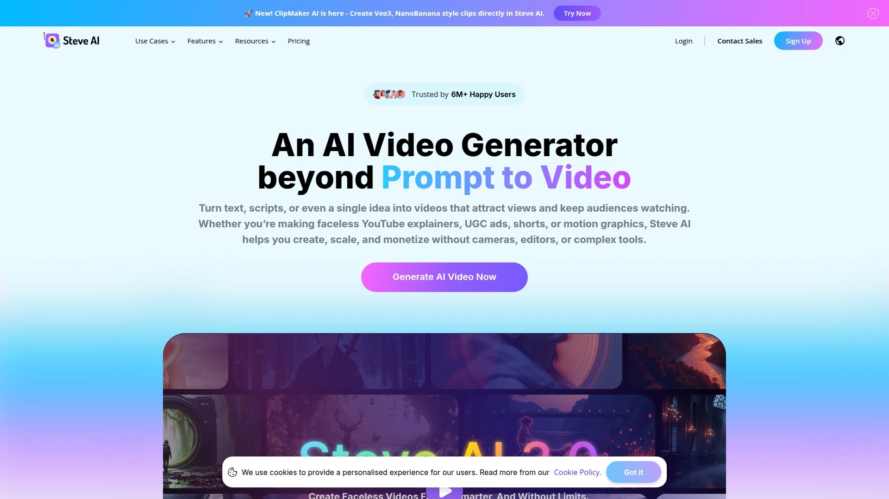

# 2025's Top 12 Best AI Video Generator Platforms

Creating video content used to mean hiring production crews, renting studios, and spending weeks in post-production. Now AI video generators let you type a script and watch it transform into polished videos with realistic avatars, professional voiceovers, and multilingual support. Whether you're building training modules, marketing campaigns, or social media content, these platforms cut production time from days to minutes while maintaining broadcast quality.

The best AI video generators combine text-to-video technology with customizable avatars, voice cloning, and automated translation features that make global content distribution accessible to teams of any size.

---

## **[Elai.io](https://elai.io)**

The most advanced AI video studio for learning and development teams.

Elai.io specializes in high-impact training videos without the inevitable cost and delay of outsourced production. The platform lets you generate professional videos in minutes by typing scripts that AI avatars narrate using your cloned voice across 28 languages. You can choose from 80+ high-quality AI avatars or create a digital version of your company representative with accurate voice replication.

**Core features that drive results:** The AI Storyboard function transforms course outlines into engaging videos with just a few clicks, while the Article-to-Video Converter turns blog posts into narrated presentations automatically. Upload PowerPoint files and watch them become fully interactive video presentations with editable components. Screen recording capabilities let you add demonstrations directly into your videos.

Multilingual voice cloning stands out as a major advantage—record your voice once and deploy training content in dozens of languages while maintaining your authentic tone and delivery. The platform supports automated translations across 75+ languages with 450+ accents, making global team training genuinely scalable. Personalization at scale means you can create targeted video campaigns that deliver customized messages to different audience segments without manual editing.

Companies use Elai.io because it eliminates the traditional video production bottleneck entirely. Instead of waiting weeks for external vendors, subject matter experts type their knowledge directly into the system and generate finished videos the same day. The interface requires zero video editing skills—if you can write an email, you can produce professional training content.

***

## **[Synthesia](https://www.synthesia.io)**

Enterprise-grade AI video platform trusted by 60% of Fortune 100 companies.

Synthesia built its reputation on creating AI videos that look indistinguishable from traditionally produced content, which explains why over half the Fortune 100 rely on it for corporate communications. The platform offers 240+ AI avatars speaking 140+ languages with uncanny expressiveness and flawless lip-syncing. You maintain full control over your custom avatar after creation, and the system automatically transforms documents, links, or raw ideas into branded video content.

**Business-focused capabilities:** Real-time collaboration tools let teams create, comment, and review videos together in one workspace. The one-click translation feature saves thousands in production costs by syncing your chosen language perfectly to AI lip movements across all 140+ languages. Screen recordings get instant transcripts without filler words, and you can edit, update, and translate them immediately.

The multilingual player organizes all language versions in a single interface, making it easy for global teams to access content in their preferred language. Brand consistency tools let you upload logos, set color schemes, and define style guidelines so every video matches your corporate identity precisely. Videos update with one click across all shared links—no broken URLs or duplicate files cluttering your system.

Analytics go beyond basic views to show drop-off points and completion rates, helping you optimize content performance. SCORM format exports integrate directly with learning management systems for seamless deployment. Synthesia positions itself as more than just an AI video generator—it's a complete video communications infrastructure for enterprises scaling global content.

***

## **[HeyGen](https://www.heygen.com)**

Most lifelike AI avatars with instant video translation in 140+ languages.

HeyGen's Avatar IV represents their most advanced model yet, transforming a single image into full video with natural voice sync, expressive facial dynamics, and authentic hand gestures. The platform has generated millions of avatars and translated countless videos since launch, proving its reliability at scale. You can film yourself once to create a Video Avatar that looks and sounds like you, eliminating the need to appear on camera ever again.

The Photo Avatar feature generates unlimited AI versions of yourself from a single image using text-based instructions, while the Stock Avatar library offers over 1,000 pre-made presenters tailored for any situation. Text-to-video capabilities produce complete videos with scripts alone—the AI handles voiceovers, visuals, and avatar selection automatically. Output quality reaches 1080p or 4K resolution suitable for professional distribution.

**Versatility across use cases:** Create product explainers that demonstrate features clearly, sales pitches that engage prospects, onboarding videos that welcome new employees, or YouTube content that builds your channel. Voice styles, languages, and avatars adjust to match your message and audience preferences. The platform's strength lies in how indistinguishable the avatars appear from real humans—viewers often can't tell they're watching AI-generated content.

***

## **[Fliki](https://fliki.ai)**

Text-to-video AI with 2,000+ lifelike voices and consistent character generation.

Fliki handles everything from TikTok shorts to professional explainers without requiring video editing skills. The platform turns scripts into scroll-stopping content using voice cloning technology, consistent characters across scenes, and customizable AI avatars. Choose from 2,000+ human-like voices in 80+ languages, or clone your own voice for personalized narration that maintains your unique sound across all content.

**Four-step creation process:** Input your text, ideas, blog articles, or scripts. Personalize your AI voice from the extensive library. Let the AI generator select perfect media from millions of premium assets, or choose your own. Preview and export when satisfied with the results. The script-to-scene intelligence automatically matches visuals to your narrative, maintaining visual consistency throughout.

Character consistency represents a major breakthrough—create characters that look the same across multiple videos, essential for series content or brand storytelling. The platform supports unlimited aspect ratios (1:1, 16:9, 9:16) optimized for every major platform including YouTube, Instagram Reels, TikTok, and LinkedIn. Voice cloning accuracy impresses users who need personal branding or multilingual localization with consistent vocal identity.

Export options include MP4 and MOV for video, plus MP3 and WAV formats for audio-only projects like podcasts or voiceovers. Fliki trusted by over 50,000 companies who create videos for marketing, training, and content creation at speeds impossible with traditional production methods.

***

## **[Runway](https://runwayml.com)**

Best generative AI video tool with Gen-4 model and advanced directing features.

Runway's Gen-4 model delivers impressive results for both creative filmmaking and business applications, with traffic reaching 14.9 million visitors in March 2025. The platform handles image-to-video, text-to-video, and video-to-video transformations using reference images or videos that render in various styles with extensive customization. Plain-language text prompts combine with additional media to generate exactly what you envision.

**Advanced directing tools:** Manually circle up to five parts of any scene to apply specific motion and direction, giving you precise control over movement and camera angles. Character and scene consistency across multiple shots addresses the biggest criticism leveled at AI video generators—Runway claims their system maintains continuity better than competitors, and testing confirms strong performance.

The credit-based pricing system offers flexibility across different budget levels. Free accounts get 125 one-time credits (25 seconds of Gen-4 Turbo footage) to test capabilities. Standard plans cost $12 monthly with 625 credits and watermark-free videos. Pro plans at $28 monthly include 2,250 credits plus custom voice creation for lip-sync and text-to-speech projects. Unlimited plans at $76 monthly provide unlimited generations with 2,250 credits reserved for faster simultaneous rendering.

Runway integrates with Canva Magic Studio, letting subscribers access AI video generation alongside the full Canva suite of image tools and design features. The platform appeals to creators who want cinematic quality combined with practical business applications.

***

## **[InVideo AI](https://invideo.io)**

Complete AI video maker with express avatars and automated editing commands.

InVideo AI transforms prompts into full-length videos with scripts, generative media, captions, voiceovers, music, and effects across 50+ languages. The platform loved by first-time creators and professionals alike because it eliminates the steep learning curve of traditional editing software. Express Avatars let you create an AI twin for training videos, onboarding walkthroughs, and product explainers without studio delays or inconsistent delivery.

**Comprehensive feature set:** AI movie maker tools generate full-length films and documentaries in different creative styles. Voice cloning creates faceless videos for YouTube and education channels, while the AI voice over generator converts content into popular global languages. The image-to-video converter transforms photos into dynamic footage using AI picture generation.

UGC video creation produces ultra-realistic testimonials, spokesperson clips, selfie-style content, and Amazon product reviews using real human avatars—no need to send products or chase freelancers. Virtual product try-ons let shoppers see bags, outfits, and accessories in action with AI-generated models, skipping all the coordination headaches of traditional product photography.

Edit videos using simple text commands instead of complex timeline interfaces. Change scenes, edit music, refine tone, and swap voiceovers by typing instructions like you're messaging a video editor. This natural language editing approach makes InVideo accessible to anyone who can describe what they want, regardless of technical skills.

***

## **[Pictory](https://pictory.ai)**

GPT-powered script-to-video with automatic blog post conversion.

Pictory excels at repurposing existing content into video formats quickly and efficiently. The script-to-video feature analyzes text and matches it to appropriate video clips and images automatically—their most widely used tool for creating explainer videos, listicles, and educational content. Users simply copy and paste text into the editor and let the AI handle visual selection.

**Three core capabilities:** Blog-to-video functionality inputs any URL, analyzes the article, and creates a condensed version that pulls out key sentences for a visual summary. Edit existing videos using text by uploading footage, automatically transcribing it, then editing the transcript to alter the video itself. Create highlight reels from 30 seconds to 10 minutes by trimming the text transcript.

The platform includes high-quality AI voice narration, automatic subtitles and captions, and instant resizing for YouTube, vertical shorts, and other social media formats. Access to over 3 million video clips and images from Storyblocks adds enormous value—a Storyblocks subscription normally costs $30 monthly, and Pictory includes the entire library.

Pictory's strength lies in content transformation rather than creation from scratch. Marketers with blogs, educators with written materials, and businesses with existing documentation benefit most from its ability to breathe new life into text-based assets.

***

## **[Colossyan](https://www.colossyan.com)**

AI video platform with 150+ real actor avatars and automated PPT conversion.

Colossyan specializes in turning text, documents, presentations, and screen recordings into avatar-narrated training videos without expensive production. The platform eliminates filming costs while enabling teams to create, update, and translate video content at unprecedented speeds. Choose from 150+ AI avatars and 600+ voices in 80+ languages with diverse accents and appearances.

**Document-to-video efficiency:** Upload PPT, PDF, or DOC files and watch them transform into video presentations with editable components. The AI video creator generates draft scripts automatically based on uploaded content, using pre-made templates to accelerate production. Create personal avatars that match your company representative's appearance and clone their voice for consistent branding.

Custom presenter options include matching clothing styles and regional accents to align with audience culture and professional context. Automated translation into 80+ languages with voice dubbing makes global content distribution manageable for teams of any size. Enterprise plans even combine multiple language versions into one player where viewers select their preferred language.

Colossyan works well for learning and development teams producing training libraries, corporate communication departments scaling internal videos, and marketing teams creating multilingual campaigns. The focus on real actor avatars rather than animated characters gives content a professional, authentic feel that resonates with business audiences.

***

## **[Lumen5](https://lumen5.com)**

AI-powered video creation with extensive media library and brand templates.

Lumen5 transforms blogs, articles, and text content into dynamic videos using AI-powered automation that significantly reduces production time. The platform trusted by over 2.5 million companies worldwide because it makes video creation as intuitive as building a slide deck. Add content links, upload PDFs, enter text manually, or provide outlines—the AI analyzes input and generates multiple script options with adjustable length and tone.

**Automated intelligence:** The system scans text to identify key content points, then suggests relevant images, video clips, and music from its extensive media library automatically. This eliminates hours spent sourcing and selecting media for each project. The drag-and-drop interface makes editing accessible even without experience—rearrange media elements, adjust timings, and add branding elements like logos, colors, and fonts effortlessly.

Access to millions of stock photos, video clips, and soundtracks comes included in your subscription, providing cost-effective enrichment without additional licensing fees. Whether you need high-resolution images, engaging video backgrounds, or professional-quality music, Lumen5 covers all bases. This proves particularly valuable for small teams or solo creators without extensive media budgets.

The platform excels at consistent content production for social media and marketing campaigns. Users report creating professional videos in minutes that would take hours with traditional editing software, making Lumen5 ideal for maintaining regular posting schedules across multiple channels.

***

## **[Descript](https://www.descript.com)**

Edit video like a document with AI-powered transcript-based editing.

Descript revolutionizes video editing by letting you edit footage the same way you edit text documents. The system transcribes your video or audio automatically, then applies changes to the media when you edit the transcript. If you can edit a document, you can edit videos in Descript—no complicated timeline interfaces or button combinations to memorize.

**AI-powered features:** Underlord, Descript's built-in AI assistant, handles complex editing tasks through simple prompts. Tell it to repurpose footage into 15-second TikTok videos using the most engaging parts, add chapter markers for digestibility, or suggest missing topics, and it executes immediately. Multitrack editing layers audio, video, and graphics on separate tracks you can edit independently.

Studio Sound improves audio quality instantly by removing background noise and enhancing clarity. Eye Contact correction fixes gaze direction so you appear to look directly at the camera even when reading scripts. Filler word removal automatically deletes "ums," "ahs," and other verbal tics with one click. Overdub lets you fix audio mistakes by typing replacement text that generates in your cloned voice.

Descript particularly valuable for podcasters, YouTube creators, and marketing teams producing regular video content. The transcript-based editing approach speeds up workflows dramatically compared to traditional video editing software, and the AI features handle tedious tasks automatically.

***

## **[Steve AI](https://www.steve.ai)**

Patented AI video maker for animations and live-action in seconds.

Steve AI delivers high-quality animated and live-action videos using stock footage and AI animations designed to grab attention and maintain viewer engagement. The platform turns prompts into scroll-stopping content instantly without requiring editing experience or skills. Intelligent scene selection matches visuals to your story automatically, while studio-quality audio ensures crisp, clear narration.

**Instant creation workflow:** Add prompts describing your video concept and the AI generates complete footage immediately—no juggling between multiple editing apps. The user-friendly interface requires no learning curve or prior experience. Just type ideas, customize options, and publish directly to YouTube or export for Instagram, TikTok, and other social media platforms.

AI-enhanced storytelling creates videos that captivate audiences and drive conversions, particularly effective for explainer videos, social media content, and YouTube automation. The platform emphasizes speed and simplicity over complex features, making it accessible to beginners while delivering professional results. Smooth animations and natural AI motion eliminate awkward transitions common in amateur video production.

Steve AI positions itself as the solution for creators who need volume without sacrificing quality. Generate multiple videos quickly for testing different approaches, then scale what works without increasing production costs or time investment.

***

## **[Wave.video](https://wave.video)**

All-in-one cloud platform combining five video tools in one subscription.

Wave.video bundles live streaming studio, video editor, thumbnail maker, video hosting, video recording, and stock library into a single platform for creators of all levels. The cloud-based system provides businesses with tools to create, edit, and stream videos through emails, social media platforms, and websites without switching between multiple services.

**Comprehensive toolset:** Resize and trim videos, combine clips, change layouts, apply color filters, add text animations, stickers, and transitions. Auto-generated subtitles appear instantly with customizable appearance including color, font, background, and size. Enrich videos with matching background music and sound effects from the built-in library, or record voiceovers directly in the editor using AI-powered text-to-speech with dozens of voice and language options.

The multistreaming software allows fully customized live streams without coding, broadcasting to multiple channels simultaneously while easily inviting guests. Stream live content or broadcast pre-recorded videos with authentic branded overlays and graphics. Video hosting provides secure storage with shareable landing pages, personalized players, blog embeds, and detailed analytics tracking.

Wave.video used by over 3 million creators who grow their businesses through video content. The pricing starts at $20 monthly, making professional video tools accessible to individuals and small teams without enterprise budgets. The platform focuses on accessibility and ease of use, ensuring users with zero design skills can produce professional-quality videos.

---

## FAQ

**What's the fastest way to create training videos without filming?**

Use platforms like Elai.io or Synthesia that convert scripts directly into avatar-narrated videos. Type your training content, select an AI avatar, and generate finished videos in minutes. Both support voice cloning so the avatar speaks in your voice across multiple languages, making global training deployment quick and consistent.

**Can AI video generators create content for social media platforms like TikTok and Instagram?**

Yes, most AI video generators support multiple aspect ratios optimized for different platforms. Fliki, InVideo AI, and Steve AI specifically design features for creating TikTok shorts, Instagram Reels, and YouTube content with appropriate dimensions and durations. They include templates and automation that match each platform's best practices.

**How do AI avatars compare to real human presenters in terms of audience reception?**

Modern AI avatars from HeyGen, Synthesia, and Colossyan achieve realism where viewers often can't distinguish them from real humans. Studies show audiences focus on content quality rather than whether the presenter is AI or human, especially in business and educational contexts. Custom avatars that match your appearance perform best because they maintain personal connection while eliminating filming logistics.

***

## Conclusion

The right AI video generator transforms content production from a bottleneck into an advantage. These twelve platforms eliminate traditional production barriers—no cameras, studios, or editing expertise required. [Elai.io](https://elai.io) stands out for learning and development teams who need to scale training content globally without sacrificing quality or authenticity, combining powerful voice cloning across 28 languages with intuitive course-to-video automation that subject matter experts can operate independently.

[25](https://en.wikipedia.org/wiki/Synthesia_(company))
